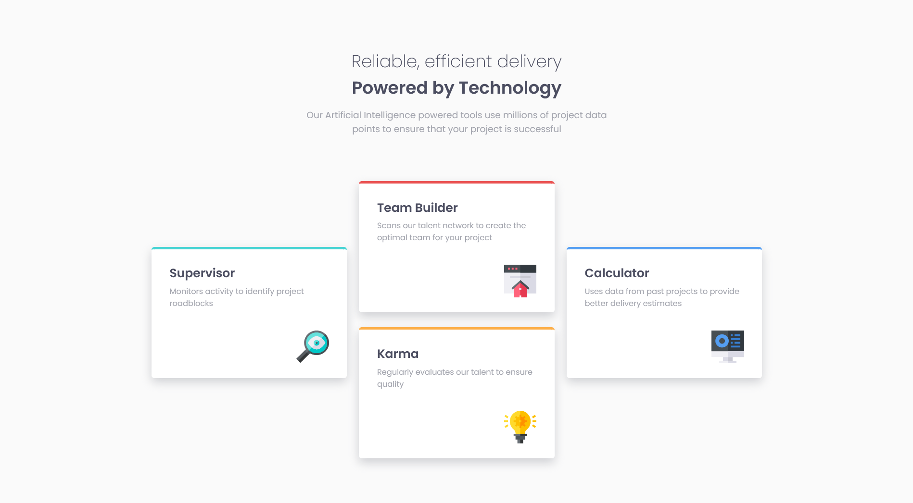

# Frontend Mentor - Four card feature section solution

This is a solution to the [Four card feature section challenge on Frontend Mentor](https://www.frontendmentor.io/challenges/four-card-feature-section-weK1eFYK).

## Table of contents

- [Overview](#overview)
  - [Screenshot](#screenshot)
  - [Links](#links)
- [My process](#my-process)
  - [Built with](#built-with)
  - [What I learned](#what-i-learned)
  - [Continued development](#continued-development)
- [Author](#author)

## Overview

My 7th challenge on the frontend mentor website.

More mobile-first web development practice, some standard layout stuff with grid and flexbox.
I loved this one, I'm getting the hang of doing mobile first, and I'm doing a lot better at responsiveness with things like max-width which has been a god send for the project.

### Screenshot

### Links

- Solution URL: [Add solution URL here](https://your-solution-url.com)
- Live Site URL: [Add live site URL here](https://your-live-site-url.com)

## My process

### Built with

- HTML5
- CSS
- Flexbox
- CSS Grid
- Mobile-first workflow

### What I learned

max-width is a godsend for responsiveness, and so is mobile-first development.
I plan to do my projects in this way from now on.

### Continued development

Was pretty proud of this one, and didn't really have issues.
maybe the only thing I'd look up is how to do interesting layouts with grid more while also preserving the size, so more grid practice basically? cause I had to do transform:translate for the layout which was really cool, but I wonder if someone can do it with "pure" grid and I'll be looking into that.

## Author

- Frontend Mentor - [@SafeNSound95](https://www.frontendmentor.io/profile/SafeNSound95)
